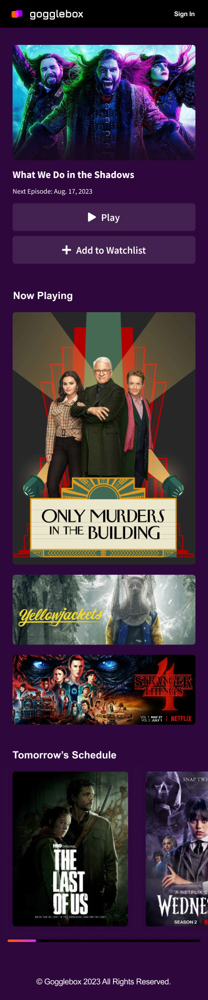
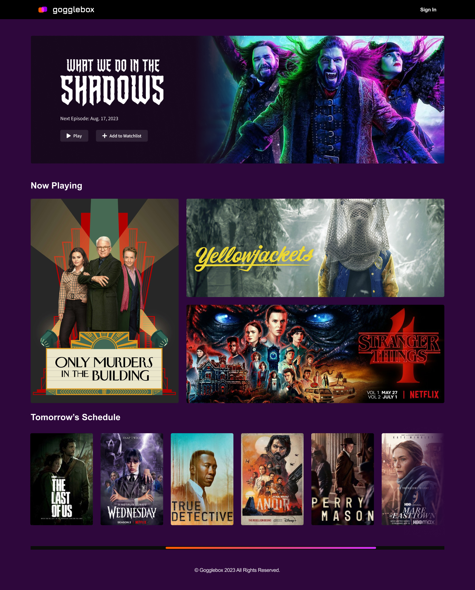

# Gogglebox Static Page
Small coding challenge designed to test basic HTML/CSS/JS competency for Living Spaces interview

## What it should look like
Mobile:

Desktop:

## Challenges
Without access to a Photoshop/Figma file for getting exact measurements/spacing/font styling, a lot of this was eyeballing and using the images as reference in Figma.

Overall I'm happy with the result.

## Potential Improvements
There's quite a few areas of improvements that could be made to enhance this coding challenge.
- Hero Image could be live text with interactive buttons
- More Interactivity in general
- Better folder organization
  - All my JS and CSS are a single file.
  - Works for a challenge this small but larger codebases would probably benefit